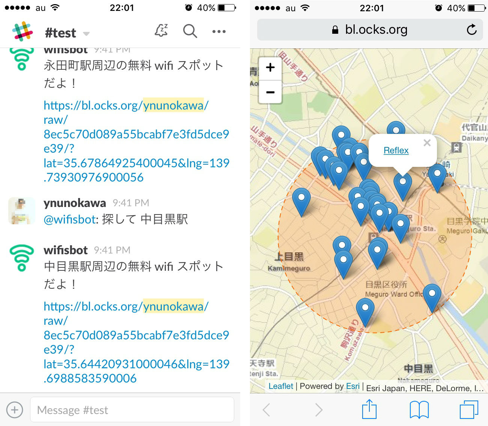

# hubot-spatial

I (=hubot) inform where nearby spots are to provide a path to map for your team.

This map can show you the place and spots with lat/lng in URL parameter.

See [`scripts/spatial.coffee`](https://github.com/ynunokawa/hubot-spatial/blob/master/script/spatial.coffee) to know me.



## Installation

`npm i hubot-spatial --save`

## Configuration

You can change a data provider to give a location of spots. The spots is [free wifi points in Japan](http://opendata.arcgis.com/datasets/fa3f0767bdaa4cd8996d3c737aec2dd1_0) as defaut.

1. Fork [the gist](https://gist.github.com/ynunokawa/8ec5c70d089a55bcabf7e3fd5dce9e39)
2. Change the code for REST URL (ArcGIS Feature Layer) to provide a data and a field name for title in your gist
```js
var titleFieldName = 'field name for title';
...
var query = L.esri.query({
	url: 'your service URL'
});
```
3. Change the code for path to map and in [`scripts/spatial.coffee`](https://github.com/ynunokawa/hubot-spatial/blob/master/script/spatial.coffee)
```coffee
appUrl = 'https://bl.ocks.org/username/raw/gistid/?lat=' + json.candidates[0].location.y + '&lng=' + json.candidates[0].location.x
```

## Interaction

```
you> 探して 東京都墨田区押上1-1-2
hubot> 東京都墨田区押上1-1-2周辺の無料 wifi スポットだよ！
[https://bl.ocks.org/ynunokawa/raw/8ec5c70d089a55bcabf7e3fd5dce9e39/?lat=35.71001678400046&lng=139.81074581000053](https://bl.ocks.org/ynunokawa/raw/8ec5c70d089a55bcabf7e3fd5dce9e39/?lat=35.71001678400046&lng=139.81074581000053)
you> 探して 渋谷駅
hubot> 渋谷駅周辺の無料 wifi スポットだよ！
[https://bl.ocks.org/ynunokawa/raw/8ec5c70d089a55bcabf7e3fd5dce9e39/?lat=35.659278473000484&lng=139.70251653400055](https://bl.ocks.org/ynunokawa/raw/8ec5c70d089a55bcabf7e3fd5dce9e39/?lat=35.659278473000484&lng=139.70251653400055)
```
